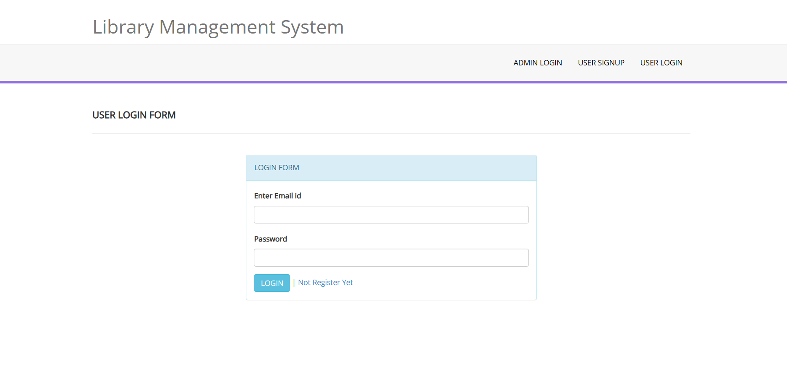

# Library Management System

This is a web-based Library Management System where users can issue and return books. The project is built using HTML, CSS, JavaScript, PHP, and MySQL.

## Table of Contents
- [Features](#features)
- [Usage](#usage)

## Features
- User authentication (login/register)
- Book issue and return functionality
- View available and issued books
- Admin panel for managing books and users

## Usage
- **User Registration/Login:** Users need to register and login to issue or return books.
- **Issue a Book:** Navigate to the 'Available Books' section and click 'Issue' next to the book you want to borrow.
- **Return a Book:** Go to the 'My Issued Books' section and click 'Return' next to the book you want to return.
- **Admin Panel:** Admins can manage books and users through the admin panel.

- ## Screenshots

